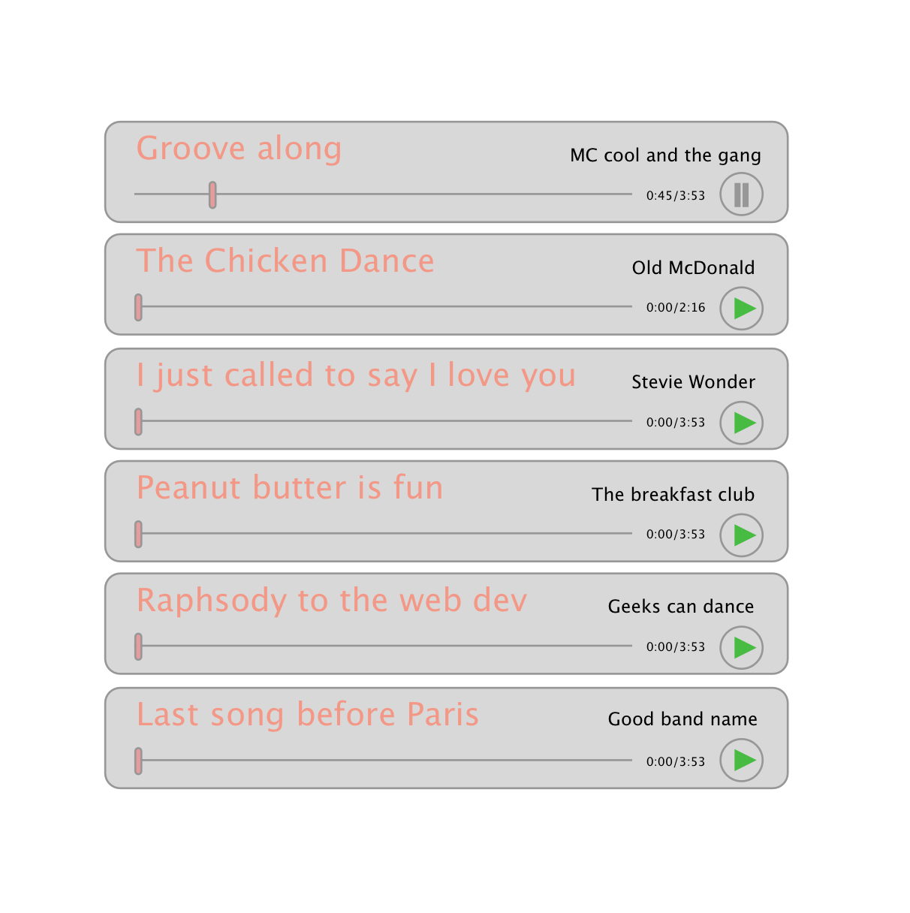

# Frontend challenge:

Create a simple web based music player.

## Getting started:

First we need to download some songs locally to be able to play them. We can use the included script in order to download a few songs from the free music archive.

```
git clone git@github.com:amiiit/frontend-challenge.git
cd frontend-challenge
yarn
yarn download
```

The output of this script is a set of wget commands. Copy and paste them into your terminal in order to download the actual mp3 files.

Now that we have the files locally, we can serve them via:

```
yarn server
```

To see the list of available tracks open [http://localhost:8081/tracks.json](http://localhost:8081/tracks.json). You will see tracks similar to the following:

```json
	{
		"artist_name": "Jacuzzi Boys",
		"album_title": "Live at WFMU for Todd-O-Phonic Todd's show, 3/3/2018",
		"artist_id": "8401",
		"artist_website": "http://www.jacuzziboys.com",
		"license_id": "126",
		"license_title": "Creative Commons Attribution-NonCommercial-NoDerivatives 4.0",
		"license_parent_id": "6",
		"license_url": "http://creativecommons.org/licenses/by-nc-nd/4.0/",
		"album_image_file": "images/albums/Jacuzzi_Boys_-_Live_at_WFMU_for_Todd-O-Phonic_Todds_show_332018_-_20180321195536085.png",
		"license_image_file": "http://i.creativecommons.org/l/by-nc-nd/4.0/88x31.png",
		"license_image_file_large": "http://fma-files.s3.amazonaws.com/resources/img/licenses/by-nc-nd.png",
		"track_id": "173098",
		"album_id": "25824",
		"agreement_id": "31083",
		"track_title": "Happy Damage",
		"track_handle": "Jacuzzi_Boys_2_Happy_Damage",
		"track_date_modified": "2018-03-21 23:58:03",
		"track_duration": "00:02:55",
		"track_number": "2",
		"track_disc_number": "1",
		"track_explicit": "",
		"track_file": "music/WFMU/Jacuzzi_Boys/Live_at_WFMU_for_Todd-O-Phonic_Todds_show_332018/Jacuzzi_Boys_-_02_-_Happy_Damage.mp3",
		"track_file_type": null,
		"track_bit_rate": "320000",
		"track_sample_rate": "48000",
		"track_composer": null,
		"track_lyricist": null,
		"track_publisher": null,
		"track_instrumental": "0",
		"track_information": null,
		"track_date_created": "2018-03-21 23:55:52",
		"track_notes": null,
		"track_status": "published",
		"track_date_recorded": null,
		"track_listens": "5019",
		"track_downloads": "1660",
		"track_favorites": "2",
		"tag_association_date_created": "2018-06-19 15:57:09",
		"originalResource": "https://freemusicarchive.org/"
	}
```

The actual mp3 file for each song is available from the local server using the `track_file` property. In the example above you should be able to fetch the mp3 under the path [http://localhost:8081/music/WFMU/NADINE/Live_at_WFMU_for_Sophisticated_Boom_Boom_with_Sheila_B_292018/NADINE_-_01_-_Ultra_Pink.mp3](http://localhost:8081/music/WFMU/NADINE/Live_at_WFMU_for_Sophisticated_Boom_Boom_with_Sheila_B_292018/NADINE_-_01_-_Ultra_Pink.mp3)

## Functional Requirements

Below is a list of functional requirements for the music player. The time frame for this task is just 2 hours so it's really okay if you don't do all of them. We are mostly interested in the way you work, think and communicate. Yes, we said communicate so it's really okay to ask for help! Today we'll be working just like team-mates so we will help you without judgment. We hope that you'll be able to complete the basic requirements and have some fun. Bonus requirements can be done later if you have time, but you can already consider them in your design from the start.

### Basic Requirements:

1. You can use whatever boilerplate/libraries you like as long as you build a React application.
1. Player loads automatically the track list from API endpoint above (`/tracks.json`)
1. Player shows a list of all available tracks. Each track shows at least a name and author, a play/pause button and a progress bar
1. It should be possible to change the current time position of the track by having buttons for jumping the time 1s/10s forwards and backwards

### Bonus:

1. At least one component to be built with TDD
1. By the end of each track, the next track should start automatically
1. Automatic start of the next track can be turned off via checkbox
1. Jump the track time by clicking on progress bar

## Draft

The following draft can help you get a general idea of how the app should look and feel. The draft isn't complete and you will probably need to add or change some elements to fit your implementation and ideas. We hope that you'll enjoy the task, good luck!


